# 📋 Guia de Migração de Banco de Dados: MySQL para SQL Server com SSMA

Este guia detalha o processo de migração de um banco de dados MySQL para SQL Server utilizando o **SQL Server Migration Assistant (SSMA)**. Certifique-se de seguir todos os passos para garantir uma migração bem-sucedida.

## 🛠️ Ferramentas Necessárias

- **SSMA for MySQL**: [Baixe aqui](https://www.microsoft.com/en-us/download/details.aspx?id=54257)
- **MySQL Connector/ODBC**: [Baixe aqui](https://dev.mysql.com/downloads/connector/odbc/)

---

## 🚀 Passos do Processo de Migração

### 🖥️ Passo 1: Baixar o SSMA for MySQL
- Acesse o [link oficial do SSMA for MySQL](https://www.microsoft.com/en-us/download/details.aspx?id=54257) para baixar e instalar a ferramenta.
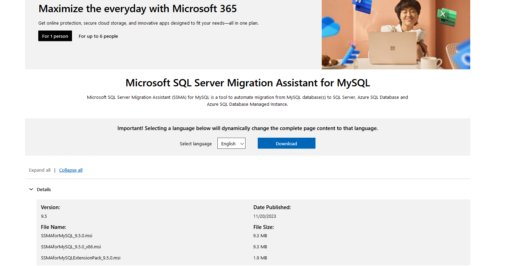

### 🏠 Passo 2: Página inicial do SSMA
- Após instalar o SSMA, abra a ferramenta e confira a tela inicial.

### 📁 Passo 3: Criando novo projeto
- No SSMA, crie um novo projeto de migração.
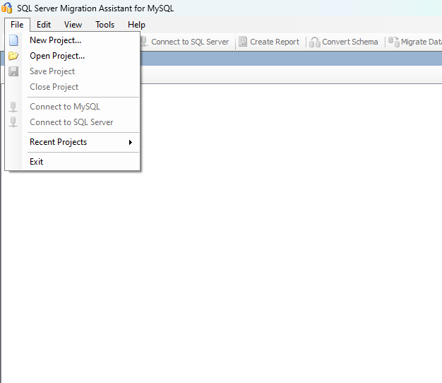

### ⚙️ Passo 4: Definindo as configurações do projeto e versão do SQL Server
- Defina o nome do projeto e selecione a versão do SQL Server que será utilizada para a migração.
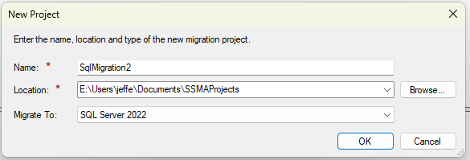

### 🔌 Passo 5: Conectando ao Banco MySQL
- Estabeleça a conexão com o banco MySQL que será migrado.

### 📝 Passo 6: Preenchendo as Informações do Banco
- **Nota**: Para que este passo funcione corretamente, certifique-se de ter executado o **Passo 7** antes.
- Preencha as informações de conexão do banco MySQL, como host, nome do banco, usuário e senha.
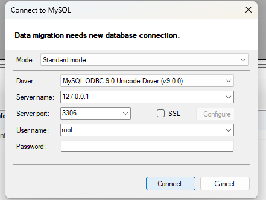

### 🔧 Passo 7: Baixando Connector/ODBC MySQL para Aplicação
- Baixe o [MySQL Connector/ODBC](https://dev.mysql.com/downloads/connector/odbc/) para permitir a conexão entre o SSMA e o MySQL.
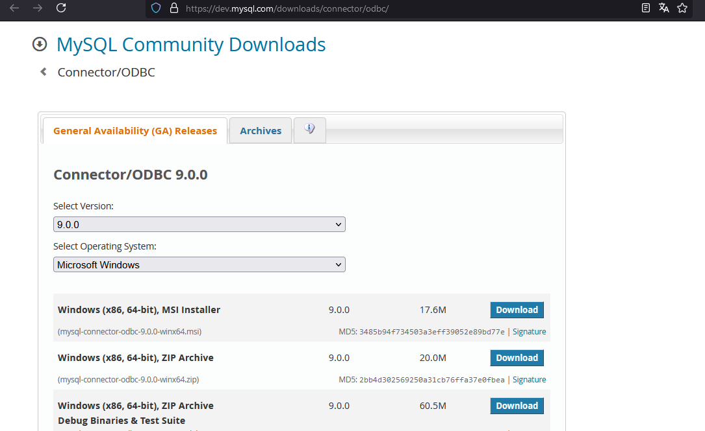

### ✅ Passo 8: Finalizado Download do ODBC
- Confirme que o download e a instalação do ODBC foram concluídos.

### 📂 Passo 9: Selecionar as tabelas que irão migrar
- No SSMA, selecione as tabelas do banco MySQL que você deseja migrar.
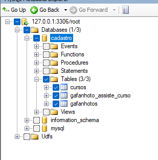

### 🔗 Passo 10: Conectando ao Banco SQL Server (Amazon RDS)
- Conecte-se ao banco de dados SQL Server hospedado na Amazon RDS.
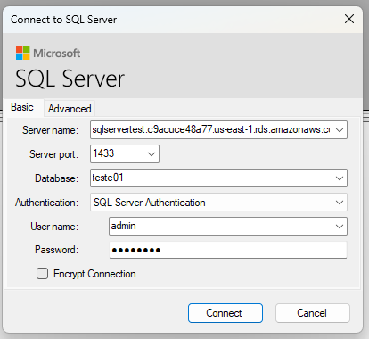

### 🔓 Passo 11: Banco SQL Server Conectado
- Confirme que a conexão com o SQL Server foi estabelecida com sucesso.
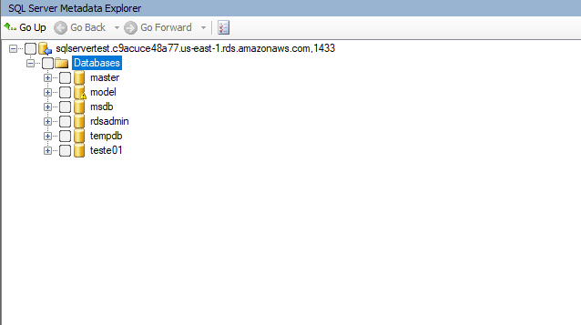

### 🔄 Passo 12: Convertendo Tabelas MySQL para SQL Server
- O SSMA irá converter a estrutura das tabelas do MySQL para o formato SQL Server.
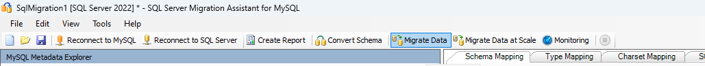

### 🎉 Passo 13: Finalizando a Conversão
- Verifique se a conversão foi concluída corretamente.
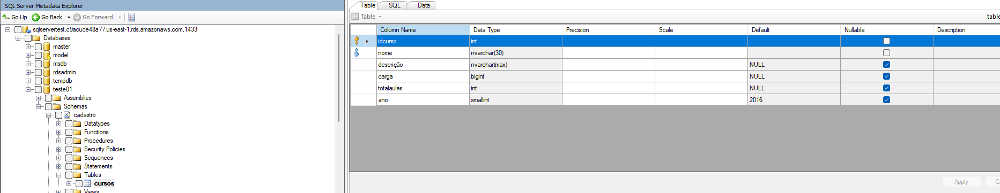

### 🚚 Passo 14: Migrando os Dados para o Banco SQL Server
- Por fim, migre os dados das tabelas MySQL para o banco SQL Server.
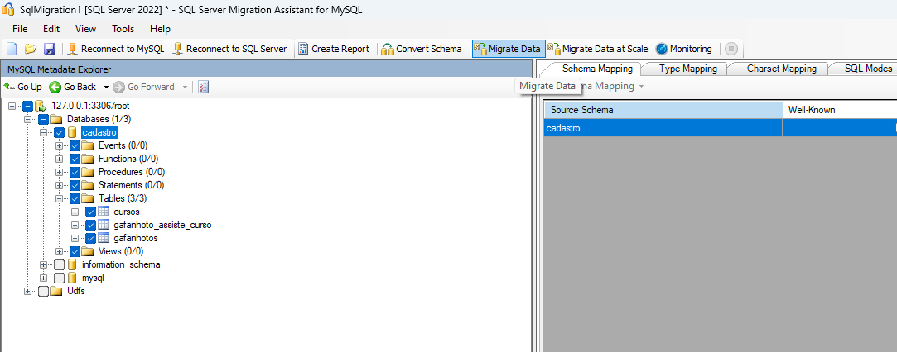

---

## ℹ️ Observações Finais
- Certifique-se de que o MySQL Connector/ODBC está corretamente instalado antes de preencher as informações de conexão do banco no **Passo 6**.
- A ferramenta SSMA é útil para simplificar o processo de migração de bancos de dados MySQL para SQL Server, automatizando a conversão de tabelas e dados.

